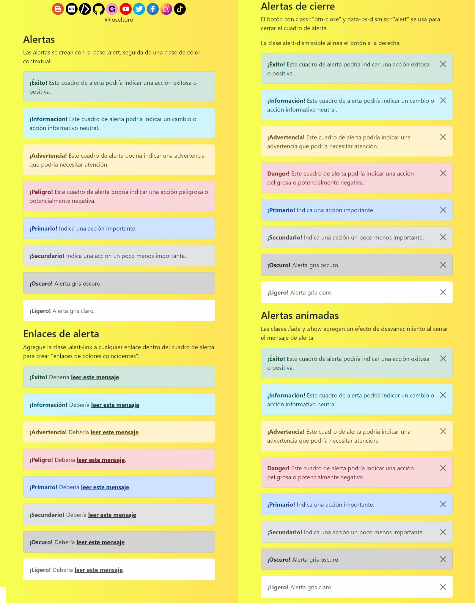

# Bootstrap 5 | Alerts

📒 Alertas

    📝Bootstrap 5 proporciona una manera fácil de crear mensajes de alerta predefinidos.

    📝Las alertas se crean con la clase .alert, seguida de una de las clases contextuales .alert-success, .alert-info, .alert-warning, .alert-danger, .alert-primary, .alert-secondary, .alert-light o .alerta-dark:

        

            <strong>¡Éxito!</strong> Indica una acción exitosa o positiva.
        

📒 Enlaces de alerta

    📝Agregue la clase .alert-link a cualquier enlace dentro del cuadro de alerta para crear "enlaces de colores coincidentes":

        

            <strong>¡Éxito!</strong> Debería <a href="#" class="alert-link">leer este mensaje.</a>.
        

📒 Alertas de cierre

    📝Cierre el mensaje de alerta, agregue una clase .alert-dismissible al contenedor de alerta. Luego agregue class="btn-close" y data-bs-dismiss="alert" a un enlace o un elemento de botón (cuando haga clic en esto, el cuadro de alerta desaparecerá).
        
        

            <button type="button" class="btn-close" data-bs-dismiss="alert"></button>
            <strong>¡Éxito!</strong> Este cuadro de alerta podría indicar una acción exitosa o positiva.
        

📒 Alertas animadas

    📝Las clases .fade y .show agregan un efecto de desvanecimiento al cerrar el mensaje de alerta:

        

Redes sociales:

- https://instagram.com/dev.joseltoro
- https://facebook.com/devjoseltoro
- https://tiktok.com/@dev.joseltoro
- https://dev.to/joseltoro
- https://code.dcoder.tech/profile/joseltoro
- https://joseltoro.blogspot.com/
- https://joseltoro.gumroad.com/